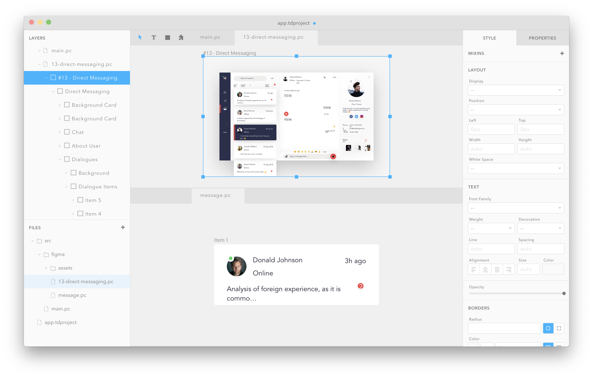

<p align="center">
  
</p>

Paperclip enables you to design and build just about any kind of web application end-to-end. It can be used directly within [Codespaces](https://github.com/features/codespaces), enabling anyone easy access to make changes to web applications.



<!-- ### Motivation

Paperclip is designed for product teams and enable anyone on that team to make changes to web applications in a safe, easy, and scalable fashion. Some example use cases that are envisioned are:

- Enable designers to make visual changes themselves (cutting down on the constant back-and-forth between devs and designers)
- Free-up developers to focus on the back-end of the front-end (instead of spending their time on HTML and CSS)-->

## Designer setup

To get started with the designer, just create a new codespace and install the Paperclip extension. After that, you'll see a new toolbar icon that you can click in order to open the designer whenever you want.

After the designer is open, you're free to edit any Paperclip file (`*.pc`) and save directly to the codebase (probably through a pull-request).

## Development setup

The develeopment tooling enables you to compile design files into application code (currently supporting vanilla React, HTML, and vanilla CSS). To get started, run the following command:

```sh
# TODO SH installation command
npx @paperclip-ui/cli init
```

This will run through the installation process for your project. After that, you can start using Paperclip locally with your existing codebase.

## CLI Usage

You can use the CLI tool to compile and edit design files locally. Here are some example commands:

```sh
# Build all paperclip files
paperclip build

# Open the paperclip designer in a browser for visual development
paperclip designer
```

## Design files

Paperclip's design files are in plain text and can be written by hand. Here's a kitchen sink example:

```javascript

// You can define "variant" styles that contain behavior like media queries
// and other CSS selectors
variant isMobile {
  "@media screen and (max-width: 400px)"
}

// Tokens enable you to define individual CSS values that you can use
// throughout your app
public token gray0 #333
public token gray1 #CCC


// Tokens can be responsive to media queries, too
public token fontSize 12px variant {
  isMobile 32px
}

public tokken fontFamily Helvetica

// You can define groups of re-usable styles throughout
// your app
style defaultFont {

  // Tokens can be referenced by `var`
  font-family: var(fontFamily)
  font-size: var(fontSize)
}

/**
 * Metadata like this allows you to specific infomation about
 * your UIs that is used in the designer
 *
 * @bounds { width: 1024, height: 768 }
 */

public component Page {


  render div {

    // Styles can be defined inlined. You can also
    // include any style that you want like so
    style extends defaultFont

    // "header" is an ID that gives your element some meaning
    div pageHeader {

      style {
        width: 100%
        background: var(gray1)
      }

      // You can define areas of your components where elements are insertable
      slot header {

        // Slots also contain default children
        text "This is a default child"
      }
    }

    div pageContent {
      slot content
    }
  }
}

// You can specify component instances
Page {
  insert header {

    // If you want, Paperclip comes with a "strict" mode that
    // disallows cascading styles and requires you to define styles
    // on each element. This provides a UX similar to Figma.
    text "Some custom header" {
      style extends defaultFont
    }
  }
  insert content {
    text "Some custom content"
  }
}
```

<!-- ## Ideal project setup

Ideally design files live in the same repository as your existing code. This will enabl -->

## Contributing

Right now, the _main_ focus for the app is around the designer UI and UX. If you're a designer and would like to help out with that, awesome! The main thing that would be super helpful is to come up with suggestions and / or design around how to improve the designer to better suite your workflow.

You're welcome to use the designer, Figma, or any tool to submit suggestions. If they're accepted, we'll wire up your designs and include the new functionality in the designer.

## Roadmap

There are a number of things on the horizon for Paperclip, not in order:

- Visual regression coverage of all UI
- Import directly from Figma
- More compiler targets
  - Various frameworks: Svelte, Vue
  - Various design systems: MaterialUI, Radix, Chakra, etc.
  - More language: PHP, Java, Ruby, etc.
- Ability to build and deploy apps built in Paperclip
- More platform targets like iOS, Android (this is a big maybe)
