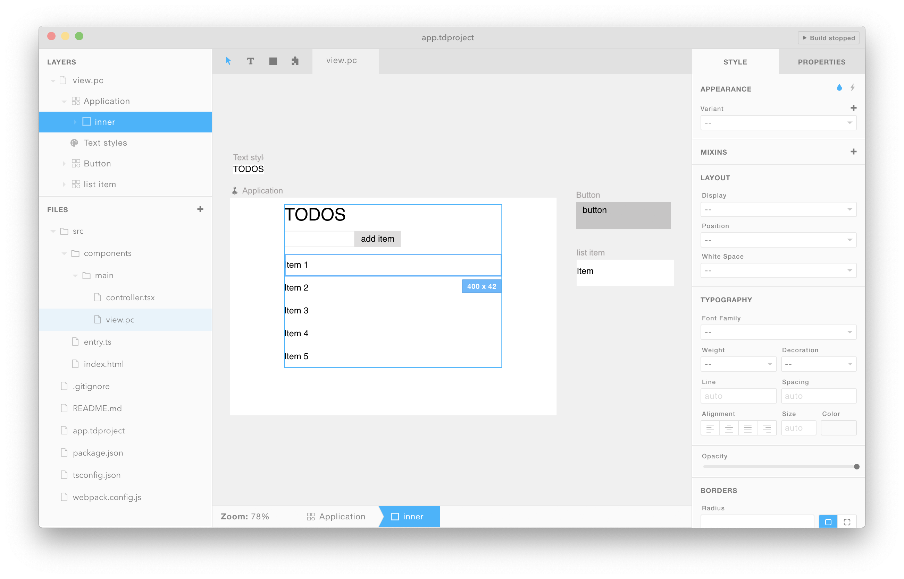
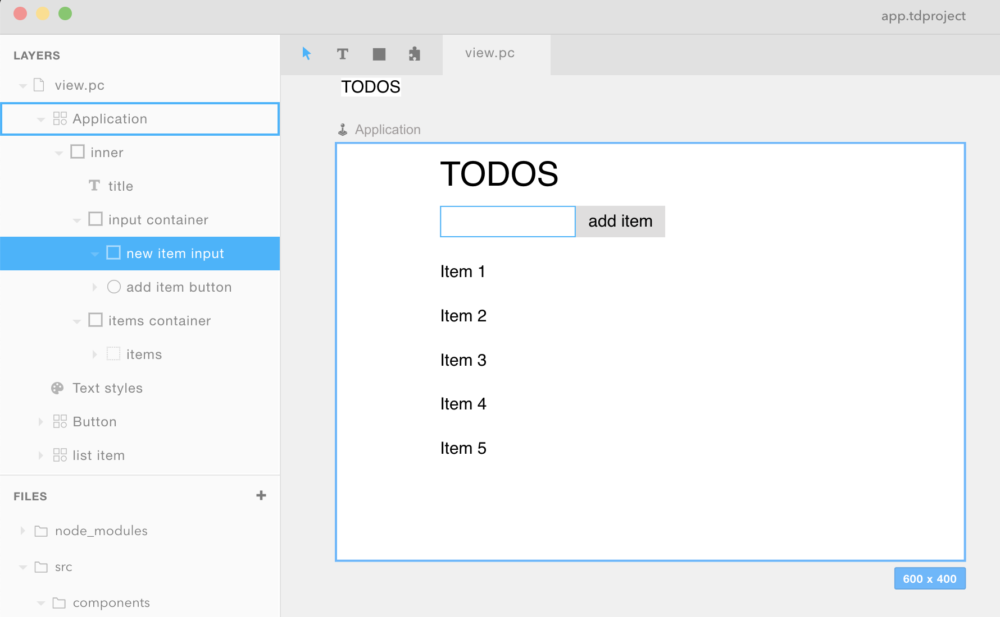

**Installation**: `npm install paperclip-react-compiler`

**Example**: [Todo App](./examples/todos)

#### Importing Tandem UIs into React

This module compiles Tandem UIs into React components, and typed definition files for those components. For example, say you have a `components.pc` UI file that looks like this:



Assuming that you don't have any [controllers](#writing-controllers) associated with the components above, you can use them like so:

```javascript
import {Application, Button, ListItem} from './path/to/components.pc';

<Application />
<ListItem />
<Button />
```

> To import `*.pc` files like this, you'll need to use the [webpack loader](../paperclip-react-loader), or the [CLI tool](#cli-usage).

Notice that the components above are all exported using their labels converted to PascalCase: `list item` is imported as `ListItem`, `Button` is imported as `Button` (no change since already PascalCase), and `Application` is imported as `Application`.

#### Setting properties to nested nodes

Looking at the layer names of our todo app:



To define props for the `new item input` & `add item button` layers, we can do that in React like so:

```javascript
<Application
  newItemInputProps={{ onChange: onNewItemInputChange }}
  addItemButtonProps={{ onClick: onAddItemButtonClick }}
/>
```

Layer props can be defined at the component level by taking the layer name, and using the camelCase version of it, then adding `Props` (excluding [slots](#using-slots)) to the end of that (`item container` -> `itemContainerProps`, `title` -> `titleProps`).

#### Using slots

Slots are areas of your component where you can dynamically insert elements (good for dynamic lists, component states, etc). You can find them in Tandem by looking for layers with a light box icon.


The `items` slot layer you see above can be coded like so:

```javascript
<Application items={"hello world"} />
```

Slots can be used by following a similar rule to element & text layers, just take the name of the slot and use the camelCase form of it when writing React code.

#### Writing controllers

A controller for our `Application` component might look something like this:

```typescript
import * as React from "react";
import { BaseApplicationProps, ListItem } from "./view.pc";

// The controller props *must* be exported
export type Props = {
  todoItems: string;
  addItem: (value: string) => void;
} & BaseApplicationProps;

type State = {
  newItemText?: string;
};

// default export needs to be a higher order component
export default (Base: React.ComponentClass<BaseApplicationProps>) => {
  // This controller wraps around the Base or logic-less component, and adds behavior to it.
  return class ApplicationController extends React.PureComponent<Props, State> {
    state = {};
    onNewItemInputChange = (event) => {
      this.setState({ newItemText: event.target.value });
    };
    onItemButtonClick = () => {
      if (this.state.newItemText) {
        this.props.addItem(this.state.newItemText);
        this.setState({ newItemText: null });
      }
    };
    render() {
      const { onItemButtonClick } = this;
      const items = this.props.todoItems.map((text, i) => {
        return <ListItem key={i} labelProps={{ text }} />;
      });
      return (
        <Base
          items={items}
          newItemInputProps={{
            onChange: onNewItemInputChange,
          }}
          addItemButtonProps={{
            onClick: onItemButtonClick,
          }}
        />
      );
    }
  };
};
```

> You can learn how to add controllers in the UI by following the [installation docs](../../docs/installation.md).

The controller wraps around UIs, so the code usage changes a bit:

```jsx
// Application is now the ApplicationController
import { Application } from "./view.pc";

const addTodoItem = () => {
  // do something
};

<Application items={["take out trash", "walk dog"]} addItem={addTodoItem} />;
```

That's the gist of it. For a more complex example, you can checkout the Tandem [front-end package](../front-end/src/components).

#### CLI Usage

Here's are some basic examples of how you can use the CLI tool:

```bash
# compile PC files & print to stdout
paperclip-react-compiler "src/**/*.pc"

# compile PC files & write to lib
paperclip-react-compiler "src/**/*.pc" --out=lib --write

# compile typed definition files for PC components & write to lib
paperclip-react-compiler "src/**/*.pc" --definition --out=lib --write

# compile UI components whenever there's a file change
paperclip-react-compiler "src/**/*.pc" --out=lib --write --watch
```

The `--definition` flag is particularly useful for identifying UI props that we can use in code. Here's an example of a typed definition generated from a UI file:

```typescript
import * as React from "react";

// Note that since the UI has a controller, we're importing the
// controllers props so that any other
import ApplicationController0, {
  Props as ApplicationController0Props,
} from "./controller";

type TextProps = {
  text?: string;
} & React.HTMLAttributes<any>;

type ElementProps = {
  ref?: any;
} & React.HTMLAttributes<any>;

export type BaseApplicationProps = {
  // this is a slot
  items?: any;
  innerProps?: ElementProps;
  titleProps?: TextProps;
  inputContainerProps?: ElementProps;
  newItemInputProps?: ElementProps;
  addItemButtonProps?: _a1a6fe8164Props;
  itemsContainerProps?: ElementProps;
  itemProps?: _a1a6fe8185Props;
  itemProps1?: _a1a6fe8185Props;
  itemProps2?: _a1a6fe8185Props;
  itemProps3?: _a1a6fe8185Props;
  itemProps4?: _a1a6fe8185Props;
} & ElementProps;

export type _a1a6fe813Props = ApplicationController0Props;
export const Application: (
  props: ApplicationController0Props
) => React.ReactElement<ApplicationController0Props>;

/*
... More generated typed definition file code ...
*/
```

> This is based on the TODO example app in the `examples/` folder.
