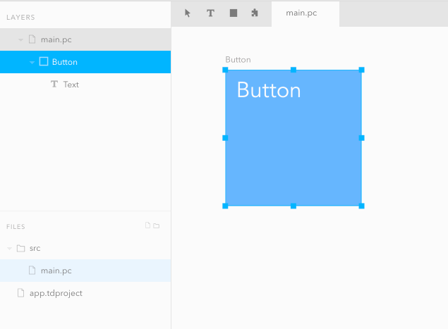
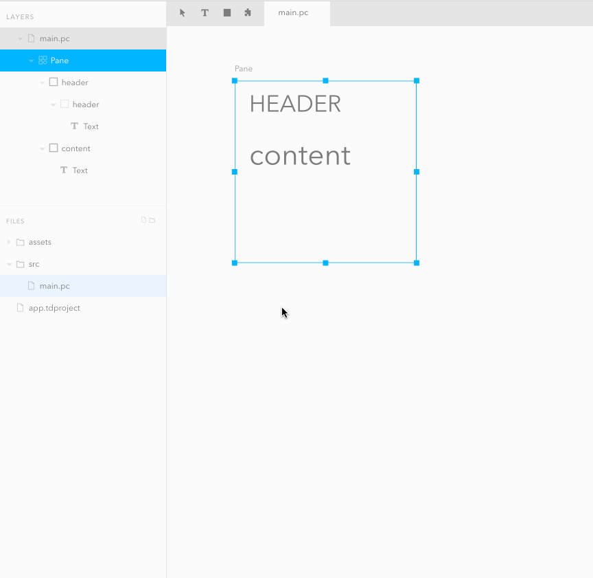
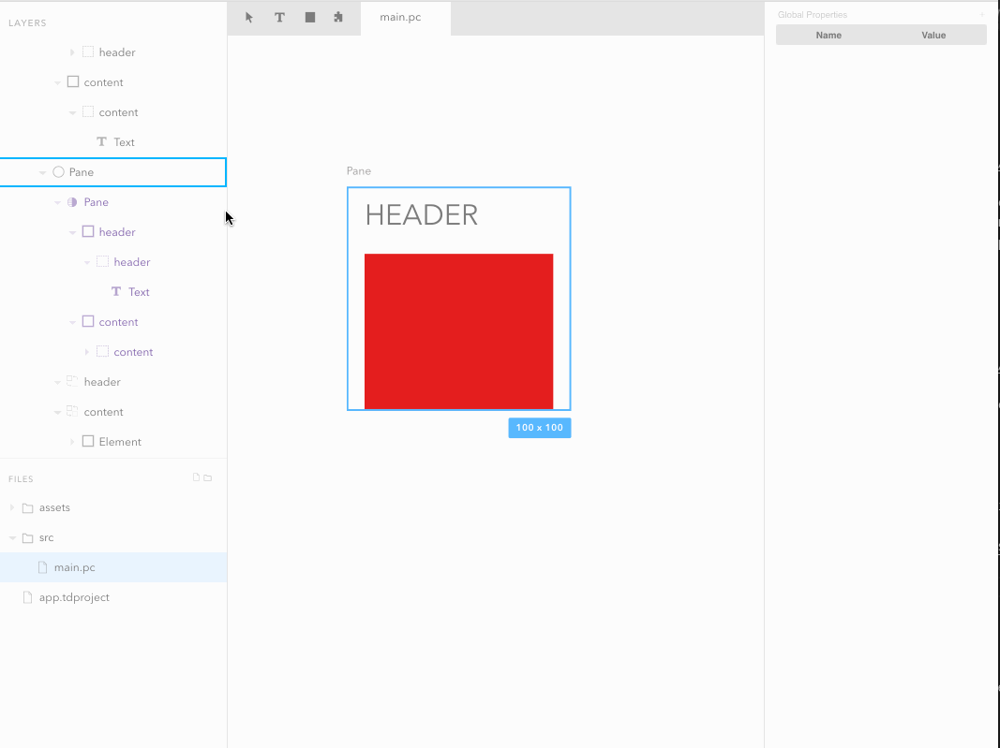
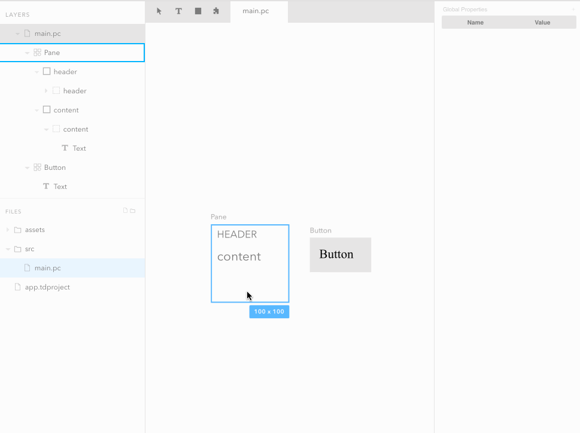
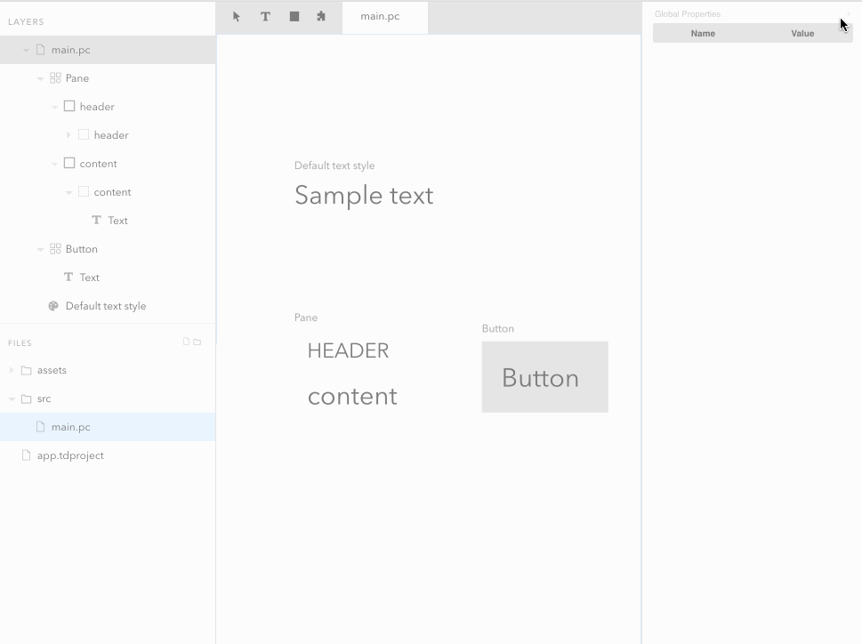
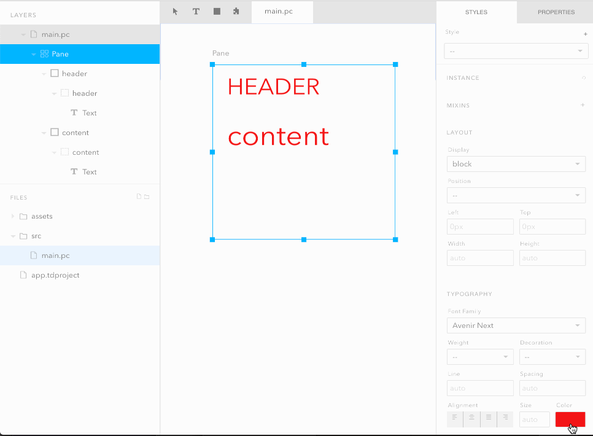
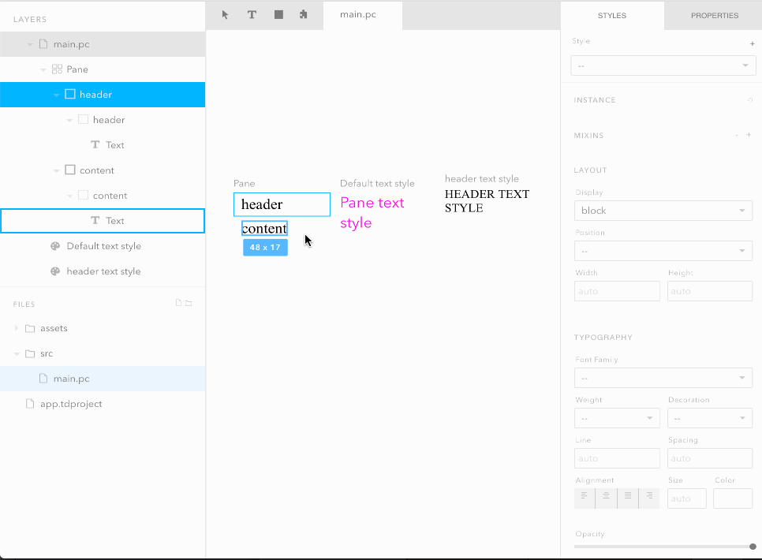
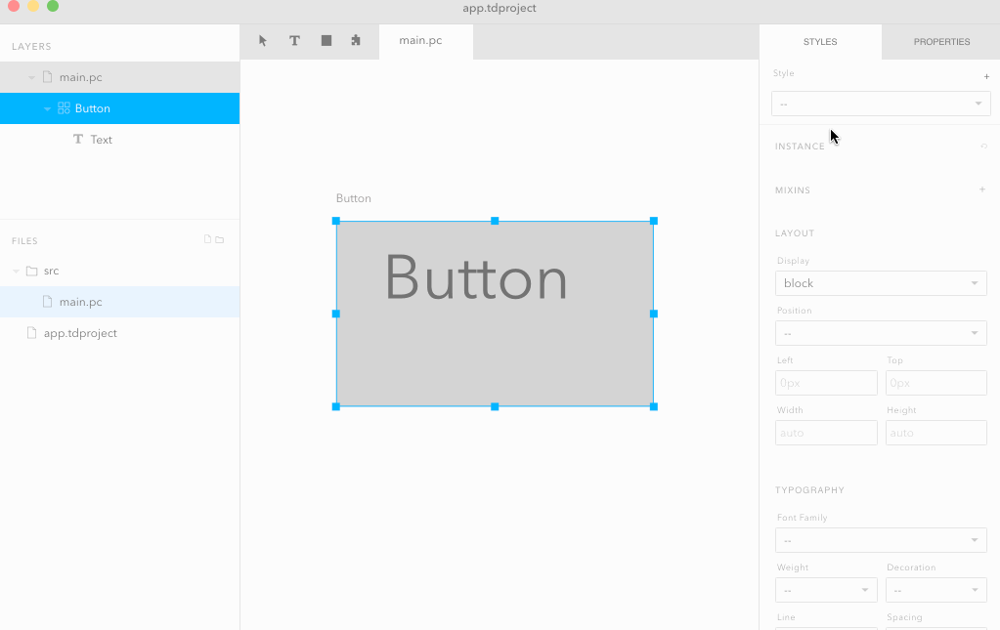

Many of the ideas behind Tandem were inspired by existing ideas (web components [shadow dom, global vars, slots, components], sass, less).

#### Component

A component is a re-usable element that can also be connected (controlled) with external code.



To convert an element into a component, right cick any node and select `Convert to Component`. To create an _instance_ of a component, either select the puzzle icon in the toolbar, or select any component, then copy & paste.

#### Component instance

An instance is linked to its associated component. If the component changes, so does the instance. All instances contain a [shadow](#shadow-nodes) that allows you to override node attribute or style in the instance.

#### Slot

A slot is a replaceable section of a component.



To create a slot, right click any node within a component (excluding [shadow nodes](#Shadow)), and select "Wrap in Slot". Slots can be used with instances.

#### Shadow nodes

Shadows are the _original_ nodes used to create instances.



Note that **styles** and **attributes** are the only things you can change for shadow nodes.

#### style mixin

A style mixin is a re-usable style that you can apply to any node.



To create a mixin, right click any node and select either `Move All Styles to Mixin`, or `Move Text Styles to Mixin`.

The primary motivation behind style mixins were to allow for groups of styles (especially for typography) to be defined and re-usable across multiple elements. They're also designed to be unopinionated, so you can mix & match whatever css properties you want.

Style mixins are _also_ teed-up for different kinds of functionality in the future, such as linking styles between your Tandem project and designer files (Sketch, and Figma). Theming may also be a possibility in the future.

#### Global Properties

Global properties allow you to keep values in one place and re-use them throughout your app.



Colors are the only global props currently supported, but more may be added in the future.

The primary motivation behind global properties is primarily to keep your app design DRY (don't repeat yourself). Global variables provide you with a _single_ value that you can apply to any CSS property that's associated with its type (a global color prop for example can only be used with color CSS properties like `background`, `color`, `border-color`, etc.).

#### Inherited styles

Certain style properties are heritable such as font properties.



In general, I try to _avoid_ using cascading CSS since it can be hard to manage, and instead use style mixins.



If you want to go a step further and _prohibit_ cascading typography completely, you can define `allowCascadeFonts: false` in your application project file `*.tdproject`. For example:

```javascript
{
  "rootDir": ".",
  "exclude": ["node_modules"],
  "mainFilePath": "./src/main.pc",
  "options": {
    "allowCascadeFonts": "false"
  }
}
```

> You can learn more about application config settings [here](./app-config.md)

#### style variants

Style variants enable you to define different states of a component.


