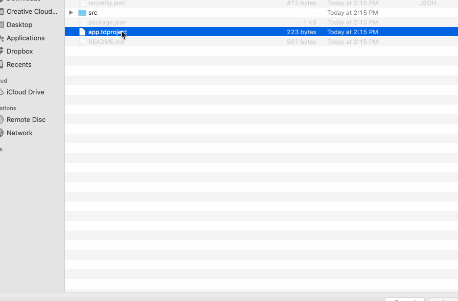
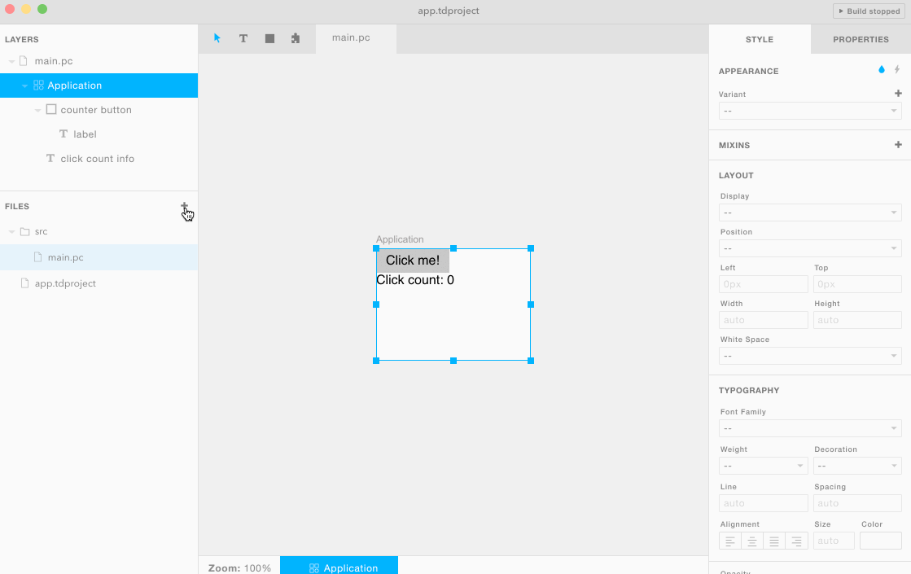

## 1. Installing Tandem in an existing project

If you just want to play around, you can download the stand alone version here: https://github.com/tandemcode/tandem/releases

If you'd like to use Tandem in your project, you should install the CLI tools:

```
npm install tandem-cli --save-dev
```

After that you can initialize a new Tandem project file by running:

```
./node_modules/.bin/tandem init
```

After you've initialized your project, you can open it up with:

```
./node_modules/.bin/tandem open
```

> If Tandem isn't already downloaded, `open` will go ahead and download the release associated with the `tandem-cli` version. Installing the `tandem-cli` package with your project (instead of globally) ensures that you're using the _correct_ version of Tandem with your UI files.
> More docs for the CLI fool can be found in the [CLI package](./packages/cli)

At this point Tandem should be opened. Go ahead and create your first component file like so:



That's it! From here you can start building UIs. Note that you can have as many UI files as you want, and they can be organized anywhere in your project. Generally what _I_ like to do is create one UI file per component.

Now onto setting up your build configuration.

## 2. Setting up the compiler

In order to use Tandem UIs, you'll need to setup a compiler for the framework you'd like to target. Keep in mind that the _coding style_ for each framework target may differ depending on community standards.

- React
  - [Setting up Webpack](../packages/paperclip-react-loader)

## 3. Adding UI controllers

UI controllers allow you to add behavior to your UIs, and they can be written in any language that's supported in Tandem. To add controller, just follow this GIF:



Controller docs:

- [React](../packages/paperclip-react-compiler)
