## Read me first!

This doc is aimed to take you step-by-step through developing your _first_ application with Tandem. Example code and videos are also provided with each phase to help you along the way.

There are many nuances, patterns, and terminology used in the app, so I wouldn't recomend skipping through any section. I also added some personal thoughts, workflows, and philosophies into the user guide here that may seem obvious to experienced developers, or people may disagree with, but a minor intent in spelling some of the higher level ideas is to show how Tandem _aims_ to be a wholesome tool.

## What is Tandem and why should I use it?

Writing HTML & CSS is a massive time sink, and the whole process of writing _visual_ code by hand feels unnatural and cumbersome. In a large front-end project, I'll probably spend about 80% of my time writing HTML & CSS, waiting for builds, cross-browser testing, and many times going back to the drawing board because hardly anything I create the first time is correct. I've _never_ shipped great HTML & CSS code. There's always been UI issues whether they break in certain browsers, or don't match their design spec. Though, deadlines get in the way, and there usually aren't enough resources or mental energy to cover every visual bug. And so I think that in almost every case, products are stuck in limbo where the user experience just feels "okay".

> Personally I find the _speed_ of writing code to be one of the most important attributes of building a product, far above writing tests, or type safety. Hardly anything that I write is "correct", and if I get to write code _faster_, then I can more quickly let products evolve in the real world, and hone them down to their essense.

Tandem was developed to be a faster & more intuitive tool around creating web components. It's intended to be simple, and only provides you with visual tooling for authoring web applications _where it makes sense_. That goes for just the _visual_ part of web apps - mainly HTML & CSS. Tandem is designed to handle most HTML & CSS cases, so you'll rarely be bogged down by writing visual code by hand (there are some complex cases that Tandem can't handle, and Tandem doesn't aim to cover every case since that would add _unnecessary_ complexity to the user experience. Sometimes code is the best medium). Tandem also provides a nice buffer between your _actual_ code since there isn't much logic involved, and that means you're able to build your UIs in Tandem _first_, then wire them up with code later on. In other words:

1. You don't need to worry or even think about what language or framework you're picking before you start using Tandem.
2. You can compile Tandem UIs to multiple language and framework targets.
3. Your Tandem UIs are more resilient to underlying to code changes.

Basically, Tandem is aimed to be a _better_, _safer_, and _faster_ way around building web components that allows you to focus on the more complicated parts of your app: code & product.

> Why should you trust that Tandem works? Well, you probably shouldn't _completely_. Like any tool, Tandem isn't able to solve every visual development problem you have (Tandem for example hasn't been tested outside of web apps, and websites [game development, ]), nor will Tandem be compatible with _every_ framework, or language. I think it's prudent to look at how this app may be compatible with your product & team, and to involve safety hatches that enable you to migrate away from Tandem if it isn't a good fit. A lot of these safety hatches are baked in (decoupling UI from your code, and migration tools in the roadmap), but it'd be disengenous for me to request that you "just trust" the app when _I myself_ have a hard to believing in perfect solutions. Every technical consideration needs a plan B. I can tell you though that Tandem is _actively_ used in building products (including itself), so a lot of its features & patterns are being _discovered_ over time instead of speculated.

#### TL;DR

Tandem allows you to visually create web components, and integrates with your existing codebase. Features for building HTML & CSS are actively being discovered based on real world usage (via product development, and that Tandem is used to build itself).

## Building your first app

In this section we'll build a simple todo app.

### Prerequisites

You'll need to have basic knowledge of HTML & CSS in order to get started, and a little coding experience doesn't hurt either if you're looking to add behavior to your UIs. Don't worry about needing to know how to code _before_ using Tandem though.

Assuming that you have some HTML & CSS chops, you can go ahead and download the current _preview_ version of Tandem here: https://www.dropbox.com/s/8k8uqxk9z37dkyr/tandem-10.1.7-osx-x64.zip?dl=0.

We'll be using [NodeJS](https://nodejs.org/) (v8.0.0+) and yarn in this tutorial, so be sure to have those installed too.

## Starting a project

Open Tandem & click "create a project". Tandem will prompt you to pick a directory where you want your project to live. If you have a projects folder directory, navigate over to that and create a new sub directory called `todos` (that's what we're going to work on). Select that new directory and click `Open`.

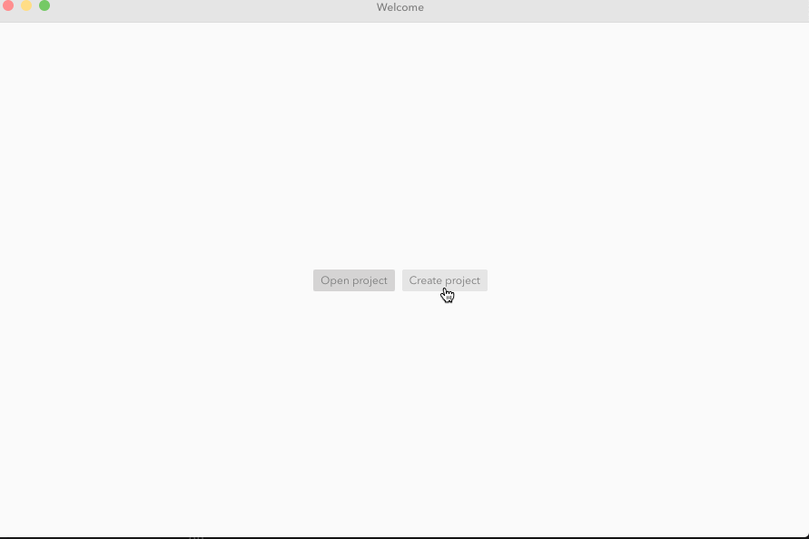

With the selected directory, Tandem will create a new group of files which make up the structure of a basic project. They are:

#### app.tdproject

The `*.tdproject` file contains your Tandem project configuration. You can checkout more information about it [here](./app-config.md). Though, the default settings will be enough for our todos app.

#### src/

The `src` directory contains all of your source files including your component files (`*.pc`), and JavaScript files. Anything that gets built basically.

#### src/main.pc

The `main.pc` is your main component file (`pc` stands for paperclip). You're welcome to organize components into _multiple_ `*.pc` files in your `src/` directory if you want. More on that later.

### Understanding the editor at a high level

We'll jump into explaining the UI real quick. I won't go into too much detail here since more UI explainations will come later on when we start creating. Go ahead and select the main `Application` frame you see in the canvas.

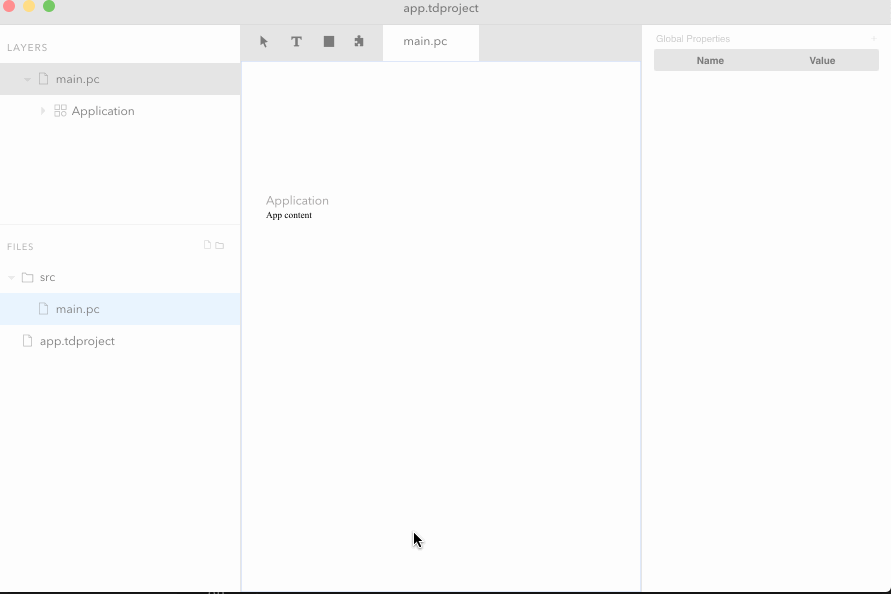

Here's a basic map of the editor:

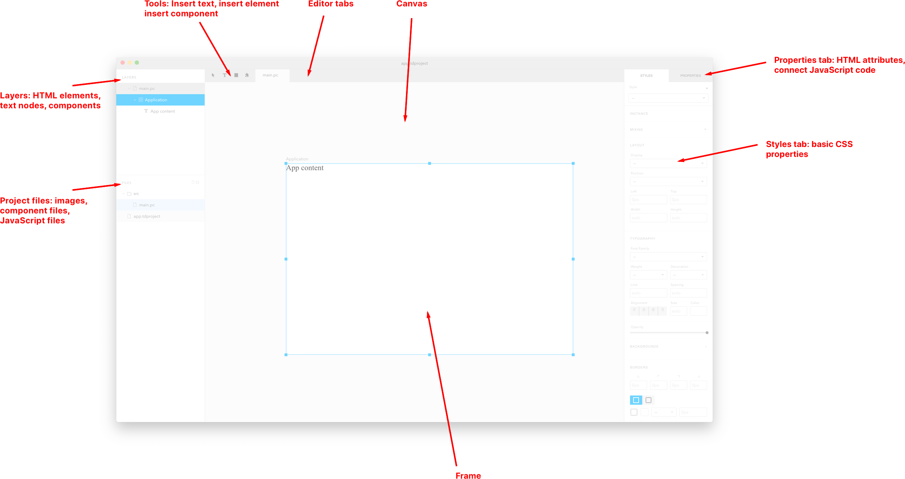

#### Project files

Starting in the lower left section, the `Files` pane contains _all_ of your project files including your JavaScript, component files, images, and other assets.

#### Layers

The `Layers` pane contains all open component files `*.pc` and gives you a view of your component structure. If you're familiar with Chrome's or Firefox's HTML inspector feature, Layers is kind of like that.

The primary function of the layers pane is to allow you to give you a structured view of your application, and to allow you to re-organize your HTML via dragging & dropping. You can also rename layers to be more specific, and they _should_ be because layer names are how custom code "injects" behavior into your UIs. More on that later.

#### Tools

Tools provide you with a way to insert new `elements`, `text`, and `component instances` into your canvas. Click _any_ tool to and you should see crosshairs. Selecting anywhere on the canvas will insert an item.

You also have hotkey options for all tools:

- `R` - insert a new element
- `T` - insert new text
- `C` - insert a component instance

> Don't worry about needing to know what a "component" or "component instance" is now.

### Creating HTML & CSS

Video here: https://www.youtube.com/watch?v=d7kcIEM1yRs&feature=youtu.be

We'll start off creating the app's HTML & CSS. We won't spend too much time making the app look pretty because I want to get around to showing the basics. Later on I'll show you how to import existing design files from Sketch and Figma to automatically create some of the UI for you. For now though, we'll keep things simple. 🙂

Here's what we're going to build:

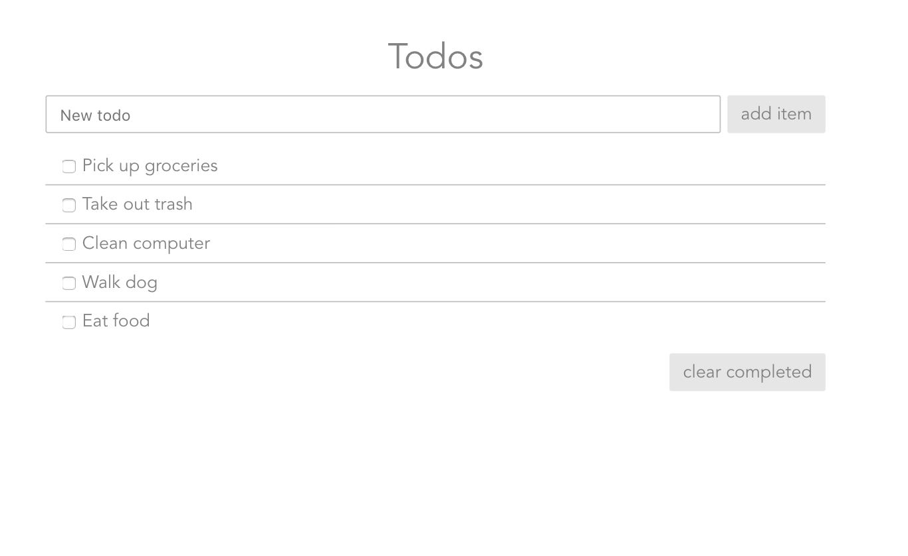

> Source code [here](https://github.com/tandemcode/examples/tree/master/user-guide-exercises/1%20creating%20HTML%20%26%20CSS).

To kick things off, click the main frame & head over to the **properties tab**, then change the preset to `Apple Macbook Air`.


Next, select the square button in the toolbar (you should see crosshairs after doing so), then click in the main application frame. This will insert a new `div` element.

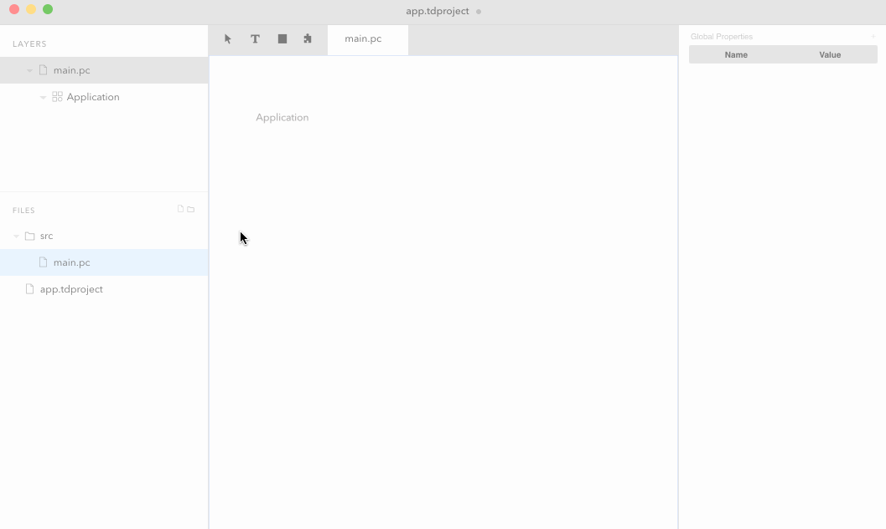

> You can also press the `R` key on your keyboard to change the canvas tool to `Element`

Next in the **styles tab**, change the settings so that the element is centered & has a restricted width. Here's some custom CSS you can copy & paste in the `Custom CSS` section at the bottom:

```
box-sizing:border-box;
display:block;
width:700px;
height:600px;
margin-left:auto;
margin-right:auto;
margin-top:100px;
```

After that, select the text tool (you can also use the `T` key) and click the center element to insert text. While the text is selected, head over to the **properties tab** and change the text value to "Todos".

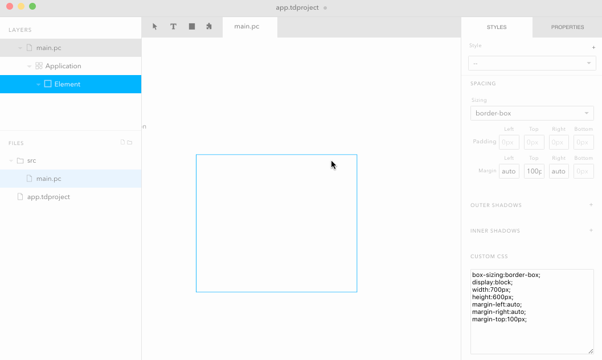

Again, change the CSS to match the todos screenshot at the beginning of this section. Here's some CSS for that:

```
display:inline-block;
text-align:center;
width:100%;
font-size:32px;
font-family:Helvetica;
margin-bottom:12px;
color:rgba(115, 115, 115, 1);
```

Insert another element into the centered container, then head over to the **properties tab** and change the type to `input`.

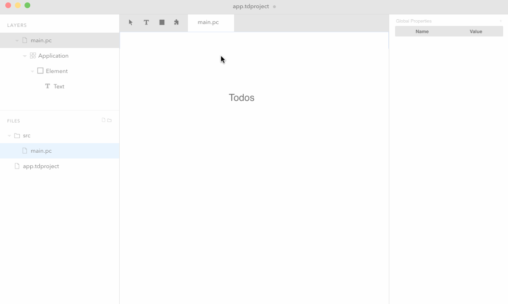

And those are the basics! As you're playing around, you'll _probably_ want to move elements, and you can do that by dragging layers.

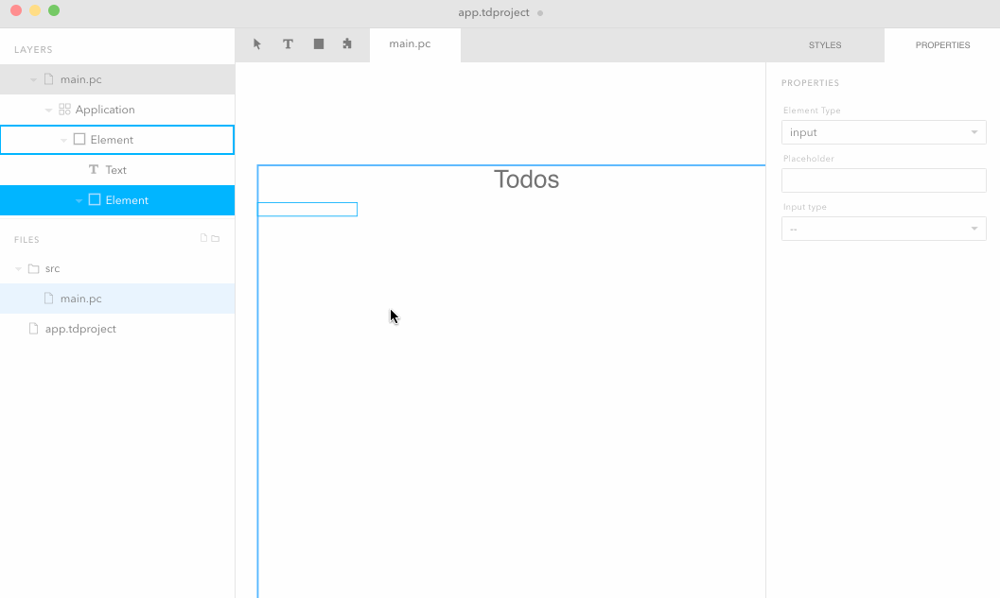

I'll leave the rest up to you to finish the Todos app, or you can just download the pre-built HTML & CSS for this section [here](https://github.com/tandemcode/examples/tree/master/user-guide-exercises/1%20creating%20HTML%20%26%20CSS).

### Creating components & re-using styles

Video: https://www.youtube.com/watch?v=0N51wft5dWI&feature=youtu.be

At this point you should have completed the HTML & CSS for the todos app. Now we're going to make our UI a bit more dynamic.

We'll start by creating a todo item [component](../concepts.md#component). Right click _any_ todo item you see and select "Convert to Component".

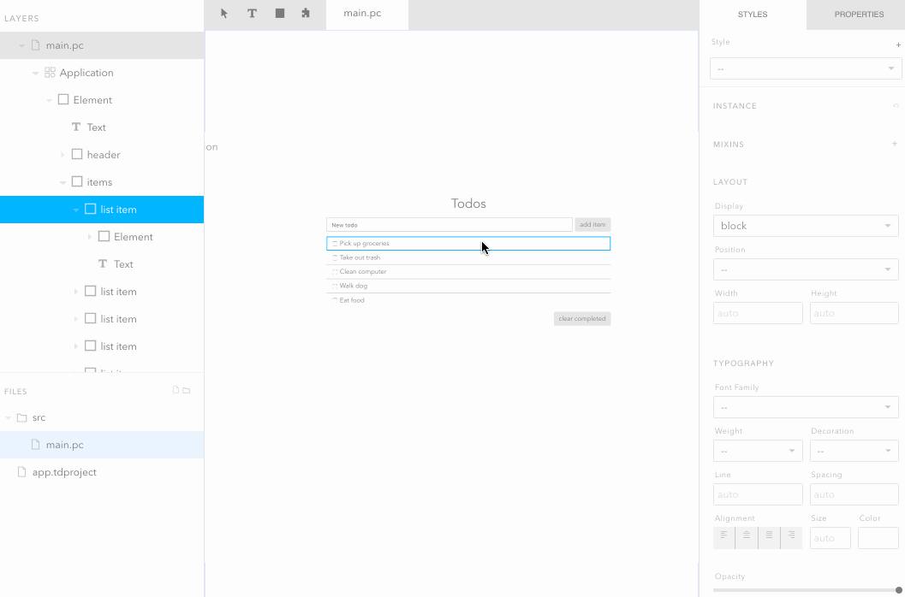

You should see a new frame added which is the _component_. The element that was replaced in the todo list is now the [component instance](../concepts.md#component-instance). If you change the component, the component instance will change too. Go ahead and try changing the text color of the component to see how that works.

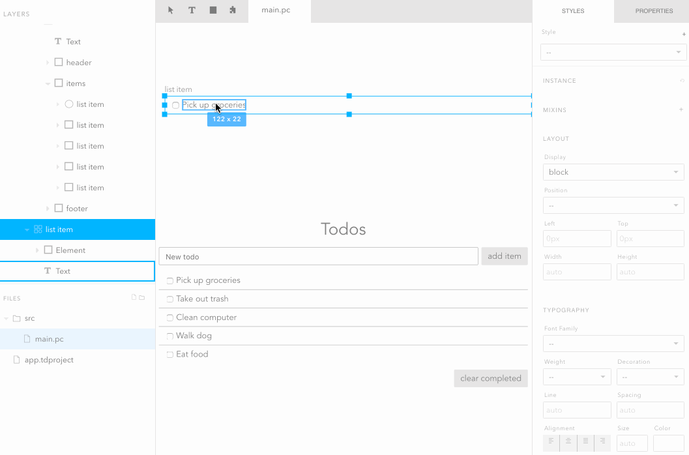

Now we're going to change all of the _other_ todo items to be instances of the new todo item component. Click each individual todo element, head over to the properties tab, and change the _type_ to the todo item component name.

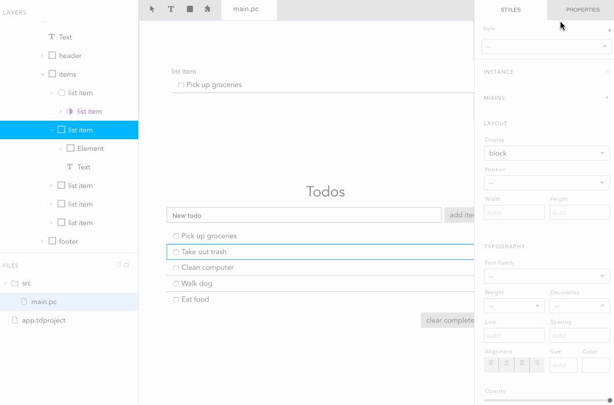

Now, _double click_ each todo item label to edit them. Change them to whatever you want.

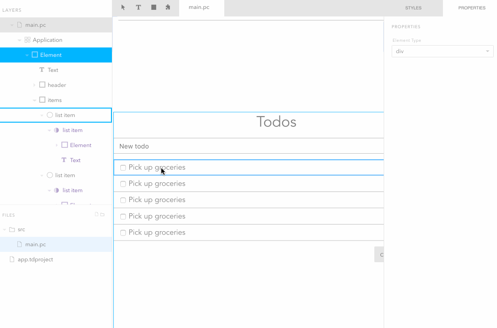

> By double clicking component instances, you're entering their [shadow](../concepts.md#shadow-nodes).

The last todo item shouldn't display a bottom border, so we're going to remove the border by creating a new [style variant](../concepts.md#style-variants). Here are the steps:

1. Select the list item component.
2. Under the **styles tab**, click the `+` button next to the Styles label at the top. A prompt will appear to provide a name. Type "last" and click "ok".
3. Scroll down to the borders section & make the bottom border color transparent.
4. Select the _last_ component instance in the todo app.
5. In the variants section under the styles tab, toggle the "last" variant.

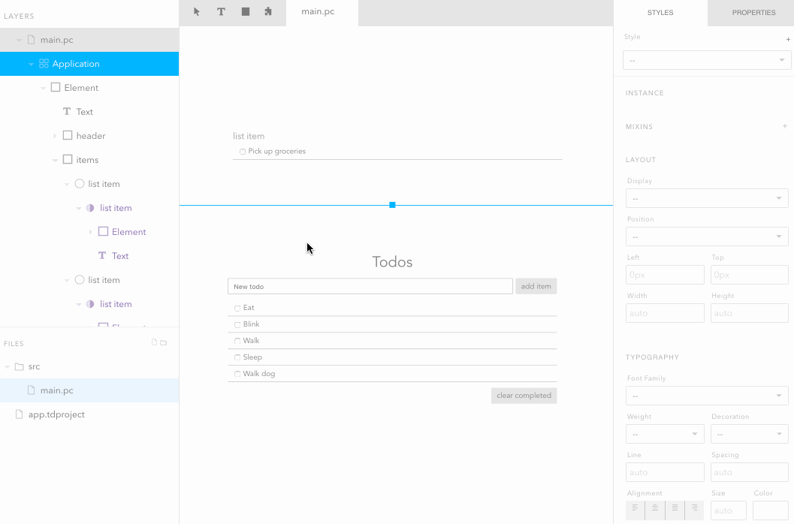

The final thing we'll do is elevate our typography to a [style mixin](../concepts.md#style-mixin) so that we have a single place where we can change our text styles.

Right click the Todos header and select "Move Text Styles to Mixin".

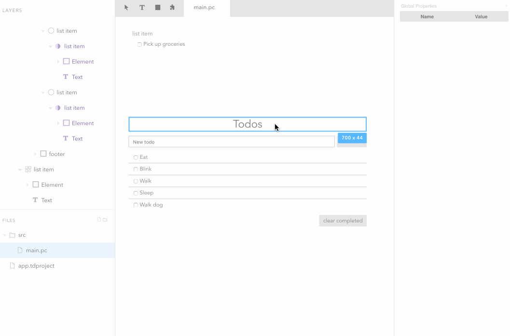

Assuming the new style mixin is selected, remove the `text-align`, and `font-size` properties. After that, re-select the Todos header and add those properties back in.

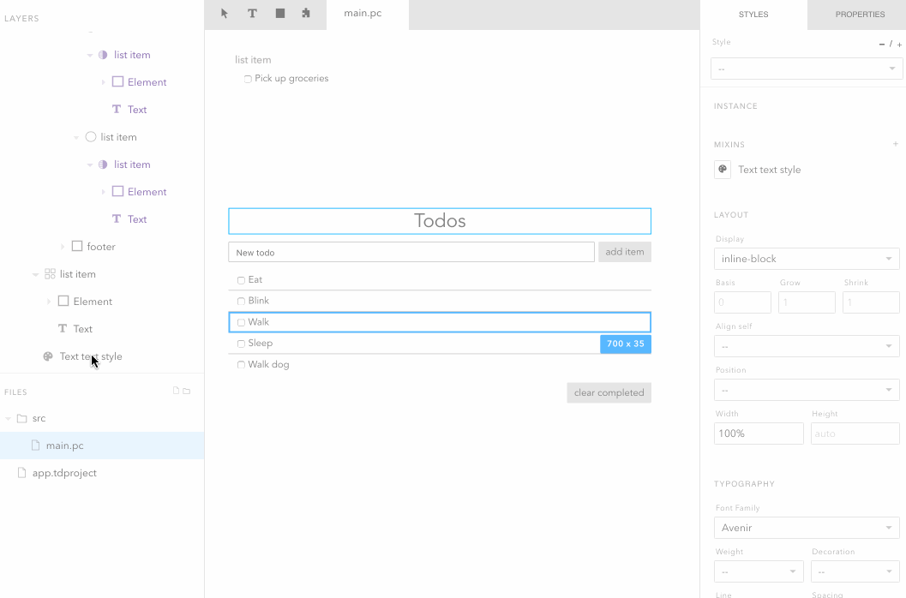

Finally, select the list item _component_ and then:

1. Ensure that the default variant is selected `--`, and _not_ `last`.
2. Clear the text styles.
3. Under the `Mixins`, select the `+` button.
4. Search for the text style mixin and press `Enter`.

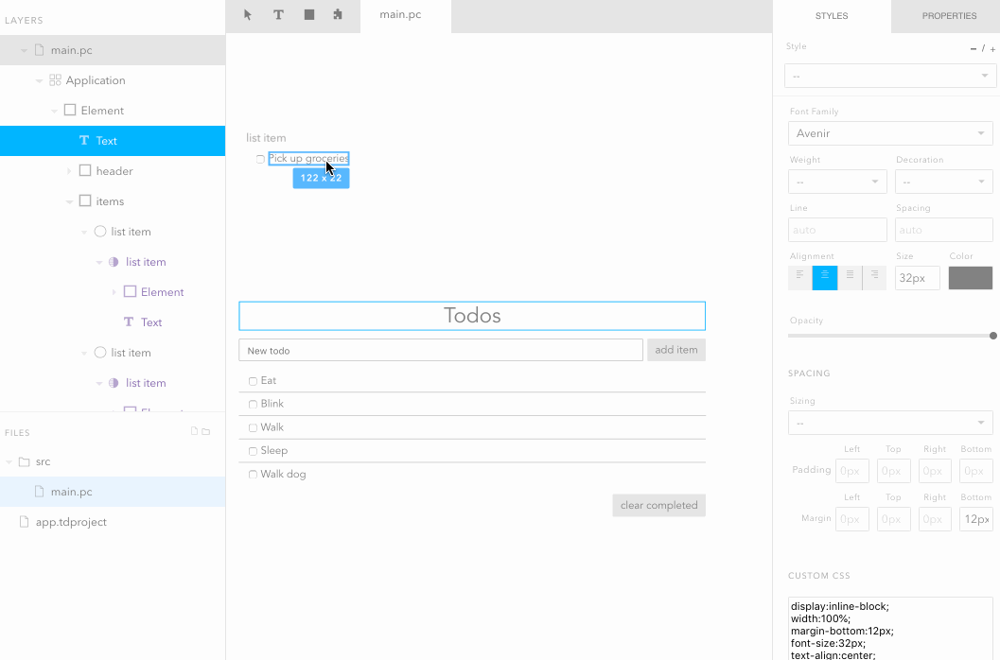

This will link the list item label to the re-usable text style. Go ahead and try changing the style mixin text color and see what happens.

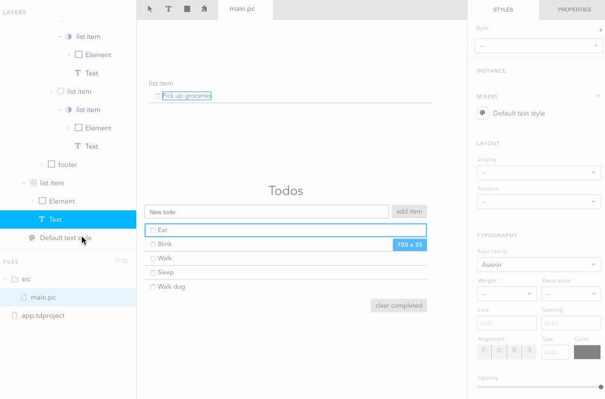

That's about it! There's still some work we can do here like making a button component and linking its label to the text style mixin, but that's on you. Or you can download the code [here](https://github.com/tandemcode/examples/tree/master/user-guide-exercises/2%20creating%20components%20%26%20style%20mixins).

Next up we're going to start integrating code.

### Integrating with Code

Video wiring up todo app: https://www.youtube.com/watch?v=jI8bZabDrxg&feature=youtu.be

At this point you're ready to add code to the todo app (yay!). This section assumes that you
have some knowledge of Terminal, Webpack, React, and TypeScript. Source code for this section is [here](https://github.com/tandemcode/examples/tree/master/user-guide-exercises/3%20adding%20custom%20code).

#### Setting up React, Webpack, and TypeScript.

> React boilerplate code used in this section can be downloaded here: https://github.com/tandemcode/react-app-boilerplate

First, copy and paste the following content to `package.json`:

```javascript
{
  "name": "todo-app",
  "version": "1.0.0",
  "main": "index.js",
  "scripts": {
    "test": "echo \"Error: no test specified\" && exit 1",
    "build-definitions": "paperclip-react-compiler './src/**/*.pc' --definition --write",
    "build:dist": "webpack",
    "build": "npm run build-definitions; npm run build:dist"
  },
  "author": "",
  "license": "ISC",
  "description": "",
  "devDependencies": {
    "@types/react": "^16.4.18",
    "@types/react-dom": "^16.0.9",
    "@webpack-cli/init": "^0.1.2",
    "html-webpack-plugin": "^3.2.0",
    "paperclip-react-compiler": "^10.0.33",
    "paperclip-react-loader": "^10.0.33",
    "ts-loader": "^5.2.2",
    "typescript": "^3.1.3",
    "uglifyjs-webpack-plugin": "^2.0.1",
    "webpack": "^4.21.0",
    "webpack-cli": "^3.1.2"
  },
  "dependencies": {
    "react": "^16.5.2",
    "react-dom": "^16.5.2"
  }
}
```

Copy the following content & paste to `webpack.config.js`:

```javascript
const fs = require("fs");
const webpack = require("webpack");
const HtmlWebpackPlugin = require("html-webpack-plugin");
const path = require("path");

module.exports = {
  module: {
    rules: [
      {
        loader: "ts-loader",
        test: /\.tsx?$/
      },
      {
        // Compiles Paperclip components to React
        loader: "paperclip-react-loader",
        options: {
          config: JSON.parse(
            fs.readFileSync(path.resolve(__dirname, "app.tdproject"), "utf8")
          )
        },
        test: /\.pc$/
      }
    ]
  },

  entry: "./src/entry.ts",

  plugins: [
    new HtmlWebpackPlugin({
      title: "App name",
      // Load a custom template (lodash by default see the FAQ for details)
      template: "src/index.html"
    })
  ],

  output: {
    filename: "[name].bundle.js",
    path: path.resolve(__dirname, "dist")
  },

  mode: "development",

  optimization: {
    splitChunks: {
      cacheGroups: {
        vendors: {
          priority: -10,
          test: /[\\/]node_modules[\\/]/
        }
      },

      chunks: "async",
      minChunks: 1,
      minSize: 30000,
      name: true
    }
  }
};
```

Copy this to `tsconfig.json`:

```javascript
{
  "compilerOptions": {
    "target": "es5",
    "module": "commonjs",
    "strict": true,
    "esModuleInterop": true,
    "jsx": "react"
  }
}
```

Copy to `src/index.html`:

```
<html>
  <head>
    <title>Todo App</title>
  </head>
  <body>
  </body>
</html>
```

After that, copy this to `src/entry.ts`:

```typescript
import * as React from "react";
import * as ReactDOM from "react-dom";

// This is our main application entry which may be wrapped by a controller
import { Application } from "./main.pc";

const mount = document.createElement("div");
document.body.appendChild(mount);

ReactDOM.render(React.createElement(Application), mount);
```

Finally, open terminal and run:

```
yarn install;
yarn build;
open dist/index.html;
```

If the above commands executed properly, your browser should be opened displaying the todo app.

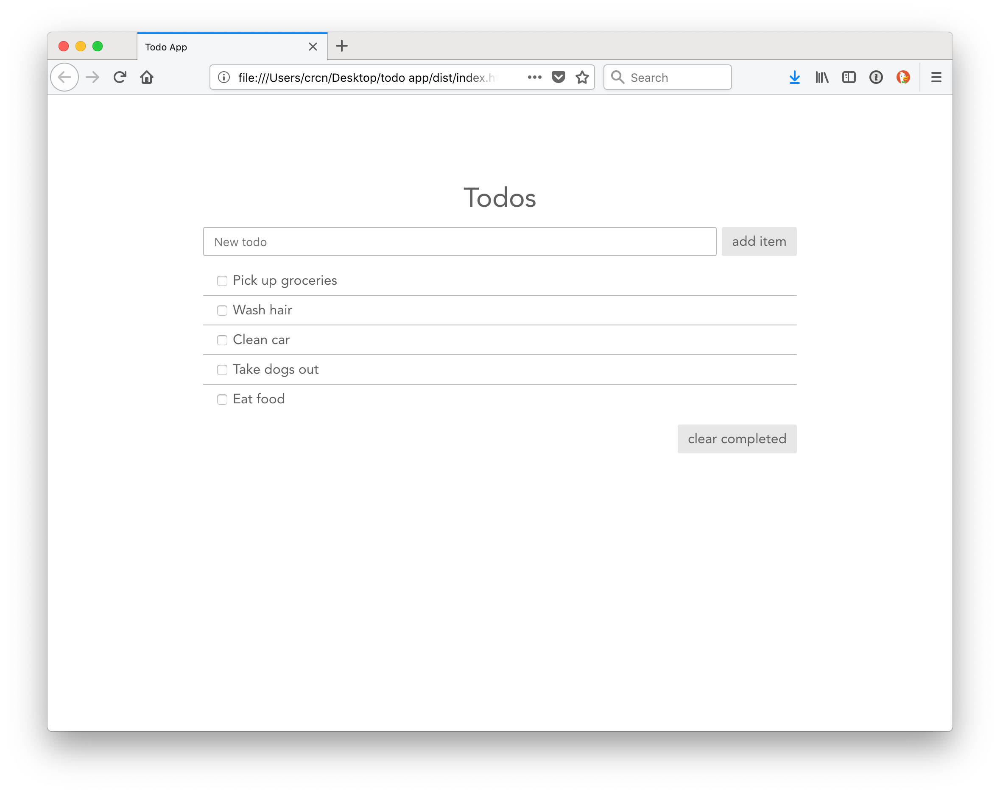

☝️ The app is unresponsive at this point. Now it's time to add custom code and bring it to life.

#### Adding behavior to components

In the Files pane, select the `src` directory and create a new file called `application-controller.tsx`. Select your `Applicaton` and head over to the **properties tab**. Under Controllers, click the `+` button and select `application-controller.tsx`.

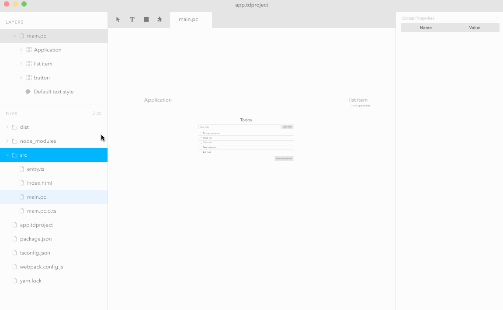

Next, open `application-controller.tsx` in your text editor and paste in the following content:

```typescript
import * as React from "react";
import { BaseApplicationProps } from "./main.pc";

// exporting "Props" is _required_ since it's exposed wherever the Application
// component is used (assuming that this controller is used on Application).
export type Props = {} & BaseApplicationProps;

export default (Base: React.ComponentClass<BaseApplicationProps>) =>
  class ApplicationController extends React.PureComponent<Props> {
    render() {
      const { ...rest } = this.props;
      return <Base {...rest} />;
    }
  };
```

This is basic controller code for Tandem components. It wraps around the target component and is used whenever the component is used.

Next, we'll need to edit the Application component to expose areas where the controller can add behavior. Select the _first_ todo item, right click it, and select "Wrap in slot". After that, rename the [slot](../concepts.md#slot) to something more specific and then drop all of the other todo items in that layer.

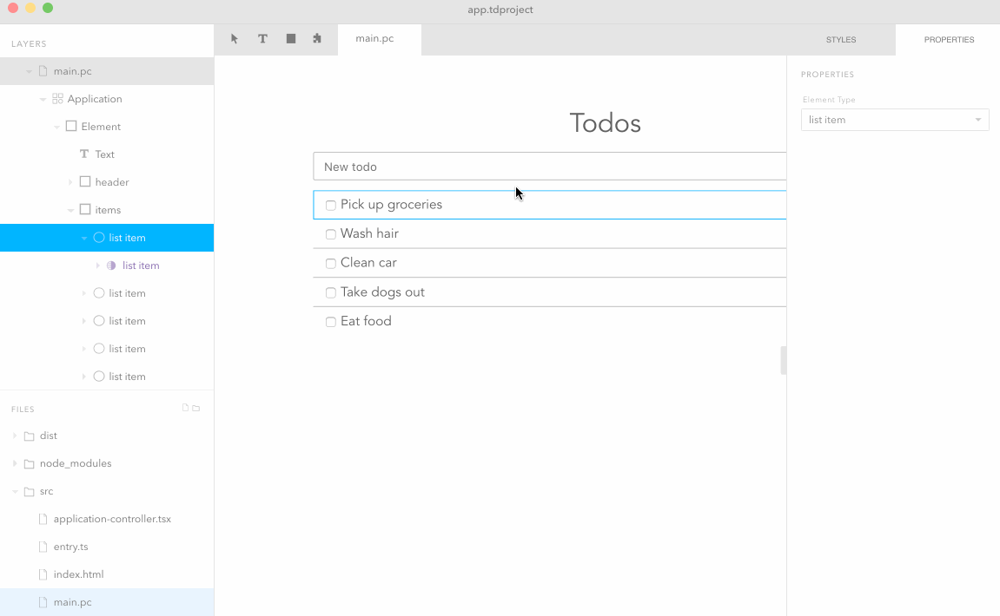

The slot provides an area of the component where children can be replaced. The slot that we just made will be the area where we insert dynamic TODO items.

After that, go ahead and run `yarn build-definitions` (this will re-create typed definition files for Tandem component files), and head back over to your `application-controller.tsx` file. Go ahead and type `items={[]}` where you're defining `<Base />` (or whatever the name of your slot is). Your file should look something like this:

```typescript
import * as React from "react";
import { BaseApplicationProps } from "./main.pc";

export type Props = {} & BaseApplicationProps;

export default (Base: React.ComponentClass<BaseApplicationProps>) =>
  class ApplicationController extends React.PureComponent<Props> {
    render() {
      const { ...rest } = this.props;
      return <Base {...rest} items={[]} />;
    }
  };
```

Rebuild your app by running `yarn build:dist`, and refresh the browser. How you should see an app without any todo items.

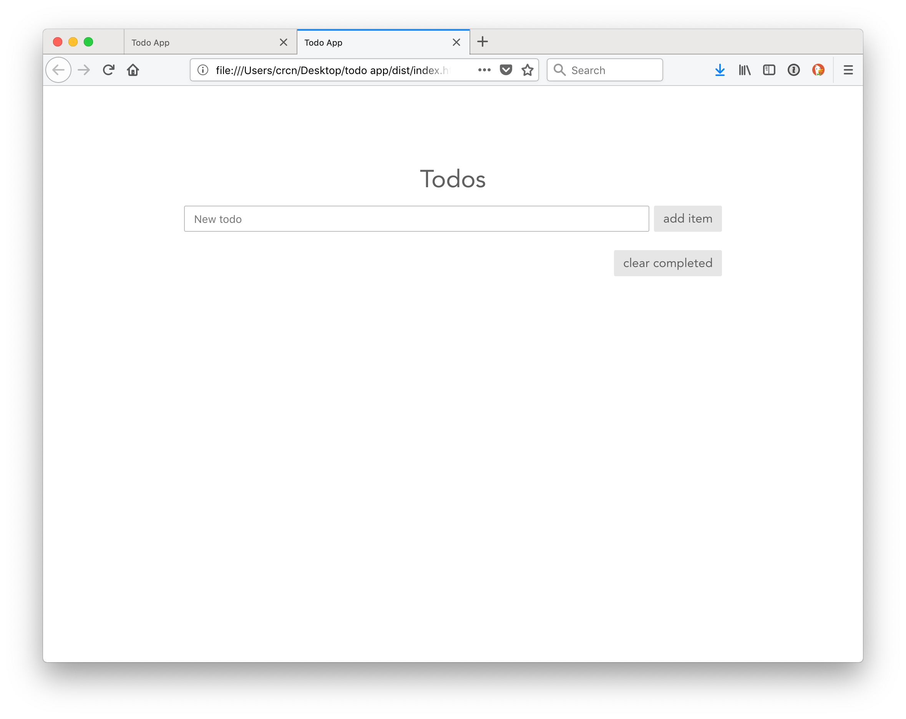

The `items` prop takes React elements, so let's add some. Write out the following code in your controller file:

```typescript
import * as React from "react";
import { BaseApplicationProps, ListItem } from "./main.pc";

export type Props = {} & BaseApplicationProps;

export default (Base: React.ComponentClass<BaseApplicationProps>) =>
  class ApplicationController extends React.PureComponent<Props> {
    render() {
      const { ...rest } = this.props;

      const items = [
        <ListItem key="item-1" />,
        <ListItem key="item-2" />,
        <ListItem key="item-3" />
      ];

      return <Base {...rest} items={items} />;
    }
  };
```

Save that, rebuild, and refresh the browser. Here's what you should see now:

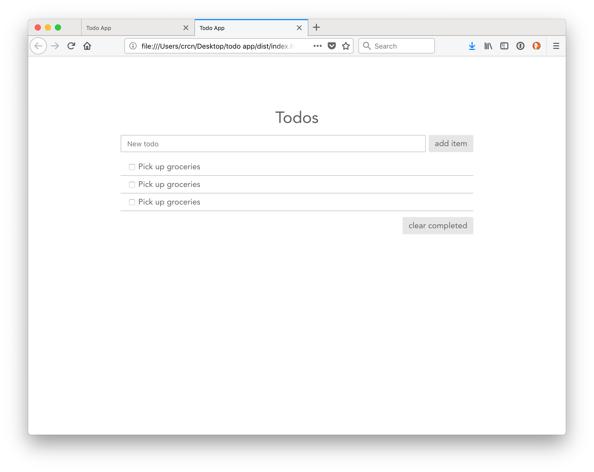

We should allow the todo item label to be changed, so head over to Tandem and change the layer name of the list item text to something descriptive like "label".

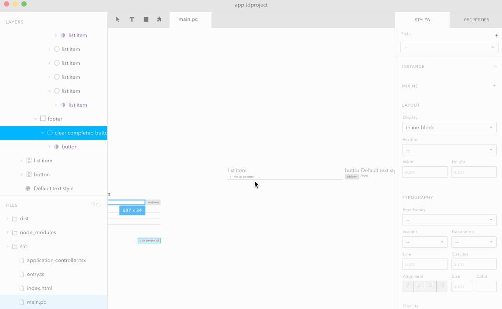

_All_ layers are exposed in React by default and given a camel case name with a `Props` postfix. `label` is exposed in React as `labelProps`, `add list item button` is exposed as `addListItemButtonProps`.

Back to our `application-controller.tsx`, change each `ListItem` to take `labelProps={{text: "Custom text here"}}`. Like so:

```typescript
import * as React from "react";
import { BaseApplicationProps, ListItem } from "./main.pc";

export type Props = {} & BaseApplicationProps;

export default (Base: React.ComponentClass<BaseApplicationProps>) =>
  class ApplicationController extends React.PureComponent<Props> {
    render() {
      const { ...rest } = this.props;

      const items = [
        <ListItem key="item-1" labelProps={{ text: "Eat wood" }} />,
        <ListItem key="item-2" labelProps={{ text: "Chop wood" }} />,
        <ListItem key="item-3" labelProps={{ text: "Smell wood" }} />
      ];

      return <Base {...rest} items={items} />;
    }
  };
```

Build that (`yarn build` runs definition & webpack script), refresh the browser, and here's what you should see:


That's basically it for adding custom behavior. All that you need to do is define props & slots. If you want to see a completed version of this app, you can checkout the source code for this section [here](https://github.com/tandemcode/examples/tree/master/user-guide-exercises/3%20adding%20custom%20code).

#### Splitting components into separate files

At some point you'll probably want to move components into separate files. Good news for you because it's super easy. Just create a new component file & drag any layer you want into it.

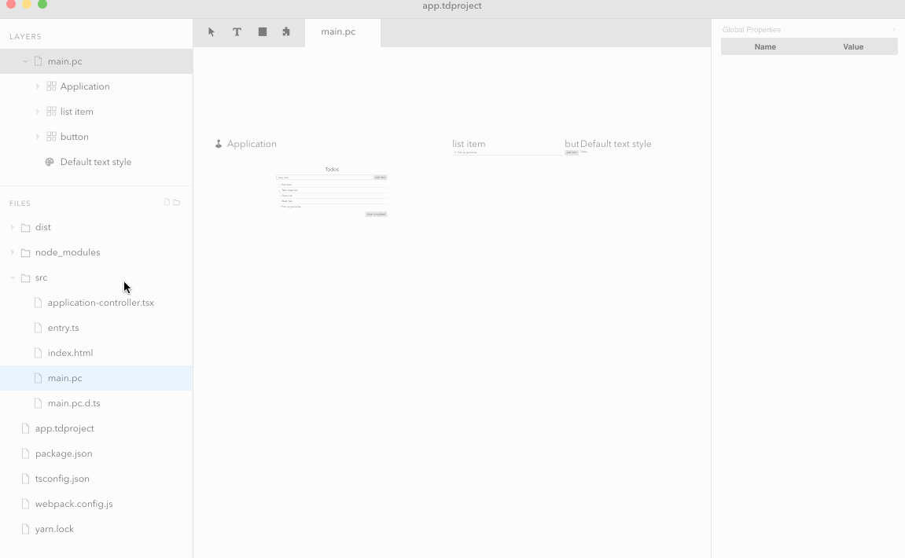

You may also need to update code that uses the component. The `application-controller.tsx` file for example would be refactored to look like this:

```typescript
import * as React from "react";

// point to ListItem in different file
import { ListItem } from "./list-item.pc";
import { BaseApplicationProps } from "./main.pc";

export type Props = {} & BaseApplicationProps;

export default (Base: React.ComponentClass<BaseApplicationProps>) =>
  class ApplicationController extends React.PureComponent<Props> {
    render() {
      const { ...rest } = this.props;

      const items = [
        <ListItem key="item-1" labelProps={{ text: "Eat wood" }} />,
        <ListItem key="item-2" labelProps={{ text: "Chop wood" }} />,
        <ListItem key="item-3" labelProps={{ text: "Smell wood" }} />
      ];

      return <Base {...rest} items={items} />;
    }
  };
```

The Tandem [front-end package](../../packages/front-end/src/components) is a pretty good example if you're looking to see how you can organize your component files.

## Integrations

There are some utilities that you can use in order to speed up the process of creating UIs depending on your workflow.

### Importing from Figma or Sketch

Video: https://www.youtube.com/watch?v=Ofqkcwc-eKE&feature=youtu.be

First up, you'll need to install the [Paperclip design converter CLI tool](../../packages/paperclip-design-converter). In Terminal, run:

```
npm install paperclip-design-converter -g
```

After that, we can start import our design. If you're coming from Sketch, you'll need to use Figma to import it into Tandem. Here's how you do that: https://help.figma.com/import/importing-sketch-files

Next, you'll need to set up a a Personal Access Token under your account settings. Copy & paste it in a safe place.

After that, open up your Figma project and copy the ID in the URL.

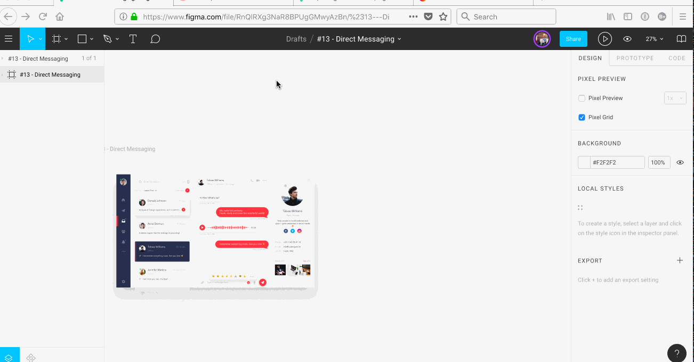

Head over to terminal and change the `cwd` to your Tandem project, then run:

```
paperclip-design-converter [PROJECT_ID] --figma-token=[PERSONAL_ACCESS_TOKEN] --output-directory=src/figma --vector-format=svg
```

Run, that, and it'll import your Figma project into Tandem. Keep in mind that the design at this point isn't ready for the web since it's unresponsive to layout changes, so you'll need to update _every_ layer to make sure that it conforms to web standards.
