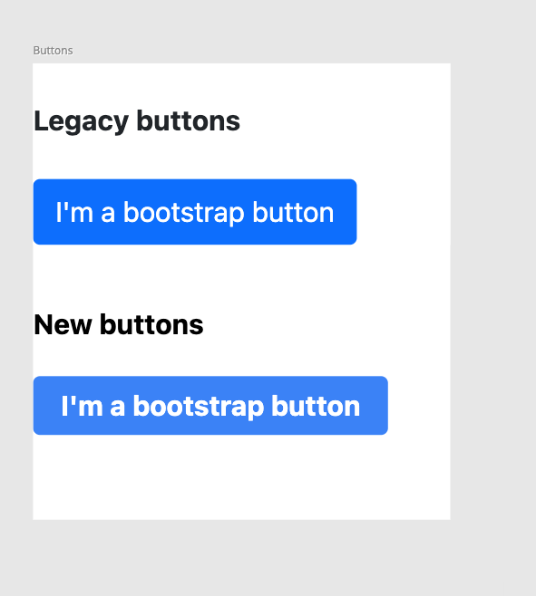

Vendor lock-in with CSS frameworks can be a particularly sticky problem, largely because of the global nature of CSS. Once you pick a CSS library with a team of engineers, you can make a pretty good bet that you’ll be incredibly hard to remove <!--truncate-->- it can just get too mangled up with the codebase. This can make it a bit nerve-wracking to introduce _any_ CSS framework, let alone one into an existing codebase where there's the risk of overriding existing styles. I think that a large chunk of this problem can be avoided by removing _global_ aspect of CSS, this is where Paperclip is handy.

[Paperclip](http://paperclip.dev) provides a way to keep HTML & CSS sandboxed & explicit. Here’s a basic example:

```html
<!-- src/atoms/typography.pc" -->
<style>
  /* everything within an @export block is accessible to other documents */
  @export {
    // apply default style rule
    * {
      font-family: Open Sans;
      font-size: 14px;
    }

    .bold {
      font-weight: 600;
    }

    h1 {
      font-size: 1.5em;
    }

    h2 {
      font-size: 1.3em;
    }

    .blue {
      color: blue;
    }

    .underline {
      text-decoration: underline;
    }

    .small {
      font-size: 1.5em;
    }
  }

  /* everything outside of an export block is private to this document */
  div {
    color: red;
  }
</style>

<div class="blue underline bold">I'm blue text!</div>
```

This file can be used in other documents like so:

```html
<import src="atoms/typography.pc" as="text" />

<!-- shorthand way of applying styles from another doc -->
<h1 class="$text blue underline">I'm a blue header!</h1>

<!-- or we can be very specific about what styles are applied -->
<div class="$text.small $text.blue">I'm small blue text</div>
```

And if you want, you can include the entire CSS scope of another document like so:

```html
<import src="atoms/typography.pc" inject-styles />

<h1 class="blue underline">I'm a blue header!</h1>

<div class="small blue">I'm small blue text</div>
```

This level of control can also be used with CSS frameworks. For example, here’s a Tailwind + Animate.css example:

```html
<!-- You can include CSS into the scope of this document -->
<import src="tailwind.css" inject-styles />

<!-- Or you can assign libraries to a specific namespace and use it throughout your doc -->
<import src="animate.css" as="animate" />

<div>
  <div class="h-screen bg-gradient-to-br from-blue-600 to-indigo-600">
    <form>
      <!-- animate in -->
      <div
        class="$animate animate__animated animate__bounceIn bg-white px-10 py-8 ...more classes..."
      >
        <!-- More code here ... -->
      </div>
    </form>
  </div>
</div>
```

> You can play with this example live here: https://codesandbox.io/s/github/paperclipui/paperclip/tree/master/examples/tailwind-and-animate

Tailwind is only applied in this document, and you’re given absolute control _where_ the library is used in your application. You can also use other libraries too like Bootstrap, Bulma, etc. What if you want to move away from one? You can easily do that. For example:

```html
<import src="modules/bootstrap.css" as="bts" />

<button
  export
  component
  as="Button"
  class="$bts btn-small btn-default"
></button>
```

Suppose you want to switch over to Tailwind, here's an example of how to do that:

```html
<import src="bootstrap/bootstrap.css" as="bts" />
<import src="tailwind.css" as="tw" />

<!--
  @frame { visible: false }
-->
<button
  component
  as="Button"
  class:bts="$bts btn btn-primary"
  class:tw="$tw bg-blue-500 hover:bg-blue-700 text-white font-bold py-2 px-4 rounded"
>
  {children}
</button>

<!--
  @frame { title: "Buttons", width: 241, height: 264, x: 564, y: 0 }
-->
<div>
  <!-- Using vanilla CSS here instead of CSS framework to make sure 
  that neither UI is tainted with the wrong styles (inherited declarations, maybe CSS vars) -->
  <style>
    display: flex;
    flex-direction: column;
    gap: 16px;
  </style>

  <!-- All Legacy UI goes here. We define $bts at the top to apply root styles like
   :root, body, html, and any other styles that have cascading declarations like font-family, color, etc. -->
  <div class="$bts">
    <h4>Legacy buttons</h4>
    <button bts>I'm a bootstrap button</button>
  </div>

  <!-- New UI here, isolated in its own div -->
  <div class="$tw">
    <h4>New buttons</h4>
    <button tw>I'm a bootstrap button</button>
  </div>
</div>
```

here's what this looks like:



The `class:variant` syntax gives you a way to define variant styles on any element. We're using it above between Bootstrap and Tailwind to make sure that they don't clobber each other. This pattern can also be used throughout to incrementally transition from one framework to another while also continuously deploying these changes behind the scenes (which I find to be a far safer approach to shipping big re-designs like this instead of having a feature branch that may quickly become out of date because people are touching UI code so much). And when you're migration effort is done, all you need do is flip a switch.

Paperclip should make it easy to keep them in isolation from the rest of your app. Paperclip should also allow you to more easily experiment with new libraries without worrying about them leaking into other parts of your application. You could even use multiple libraries together without worrying about them colliding with each other
